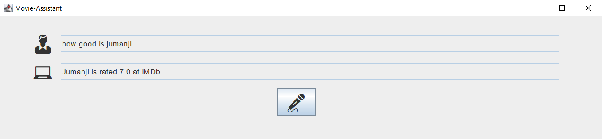
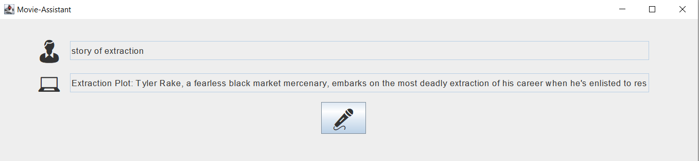
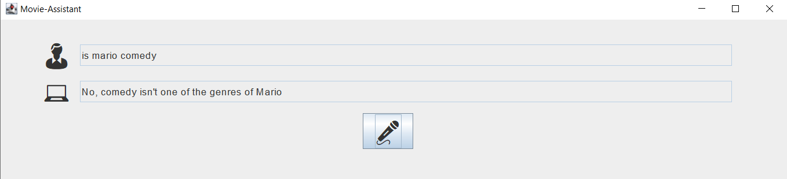

# Virtual Movie Assistant
Virtual Assistant using WIT.AI and other public APIs.
This bot understands what user want to and respond accordingly.
Like, 

*Asking for rating:

*Get plot of a movie:

*Verify genre of a movie:

*Ask to list all genre of a movie:

### To use, change the following:

*Change path for the audio file to an exisiting path.
*Change path for the API txt files to path containing your api keys.

In this version I had folder "src/APIkeys/"  
rename as:              
0MD8API -> OMDbAPI      
w17API  -> witAPI       
add your OMDbAPI in the OMDbAPI.txt
